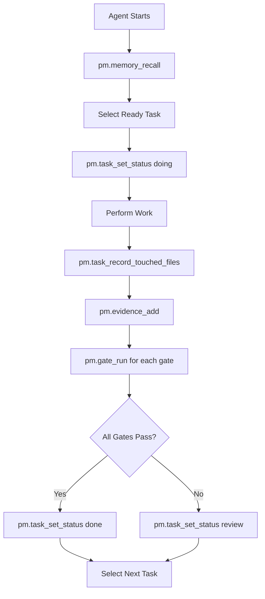

# Agent Execution Workflow

Complete step-by-step guide for agent task execution with gates, evidence, and file tracking.

## Overview



## Step-by-Step Workflow

### 1. Context Gathering

Before starting work, recall relevant history:

```typescript
const memory = await pm.memory_recall({
  projectId: 'proj-123',
  query: 'authentication implementation patterns',
  tags: ['auth', 'security']
});
```

### 2. Task Selection

Select a ready task:

```typescript
const status = await pm.status({ projectId: 'proj-123' });
const readyTask = status.tasks.find(t => t.status === 'ready' && !t.depends_on_ids.length);
```

### 3. Lock Task

Mark task as doing (locks it):

```typescript
await pm.task_set_status({
  taskId: readyTask.id,
  status: 'doing'
});
```

### 4. Perform Work

Make code changes, run tests, etc.

### 5. Track Changed Files

Record which files were modified:

```typescript
// Option A: Auto-detect with git
const result = await pm.task_record_touched_files({
  projectId: 'proj-123',
  taskId: readyTask.id,
  autoDetect: true
});

// Option B: Explicit list
const result = await pm.task_record_touched_files({
  projectId: 'proj-123',
  taskId: readyTask.id,
  files: ['src/auth.ts', 'src/auth.test.ts']
});

// Check for warnings
if (result.comparison.warnings.length > 0) {
  console.warn('File mismatch:', result.comparison.warnings);
}
```

### 6. Add Evidence

Document what was done:

```typescript
await pm.evidence_add({
  projectId: 'proj-123',
  taskId: readyTask.id,
  type: 'diff',
  content: gitDiffOutput
});

await pm.evidence_add({
  projectId: 'proj-123',
  taskId: readyTask.id,
  type: 'log',
  content: testOutput
});
```

### 7. Run Gates

Execute verification gates:

```typescript
const gates = await pm.gate_status({ projectId: 'proj-123' });

for (const gate of gates) {
  const run = await pm.gate_run({
    projectId: 'proj-123',
    gateName: gate.gate_name,
    taskId: readyTask.id
  });
  
  if (run.status === 'failing') {
    console.error(`Gate ${gate.gate_name} failed:`, run.stderr);
  }
}
```

### 8. Complete Task

Mark task as done (requires evidence):

```typescript
try {
  await pm.task_set_status({
    taskId: readyTask.id,
    status: 'done'
  });
} catch (error) {
  // Evidence rule will throw if no evidence attached
  console.error('Cannot complete task:', error);
}
```

## Error Handling

### Evidence Rule

Cannot mark task done without evidence:

```typescript
// Will throw ValidationError
await pm.task_set_status({ taskId: 'task-123', status: 'done' });
// Error: Cannot mark task as done without evidence
```

### Research Gating

Cannot start implement/verify tasks if research deps incomplete:

```typescript
// Will throw ValidationError if research not done
await pm.task_set_status({ taskId: 'impl-task', status: 'doing' });
```

### Blocker Rule

When blocked, must provide reason:

```typescript
await pm.task_set_status({
  taskId: 'task-123',
  status: 'blocked',
  blockedReason: 'Waiting for API key from ops team'
});
```

## Best Practices

1. Always call `pm.memory_recall` before starting new work items
2. Use `autoDetect: true` for file tracking when possible
3. Add evidence throughout work, not just at the end
4. Run gates frequently to catch issues early
5. Check file comparison warnings - they may indicate scope creep


