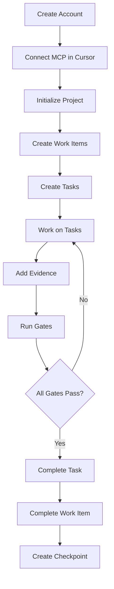
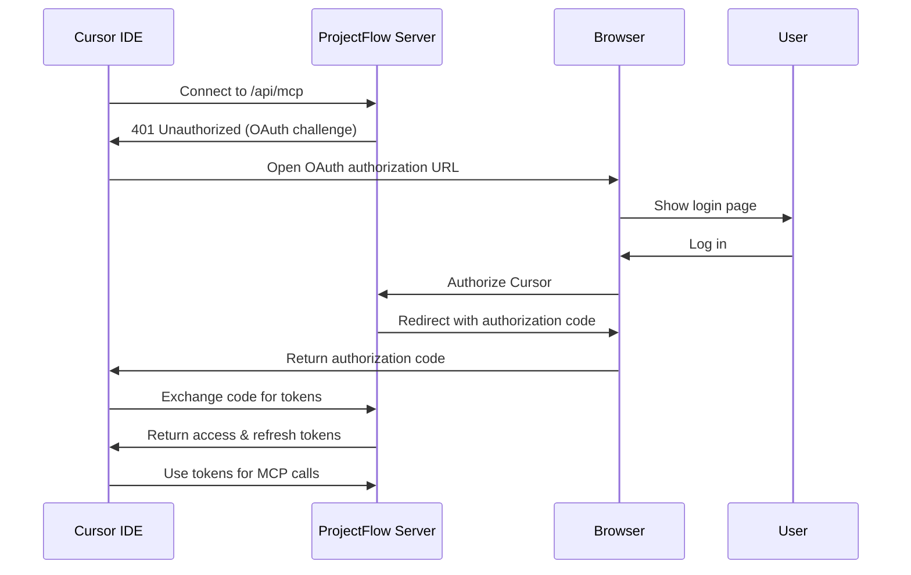
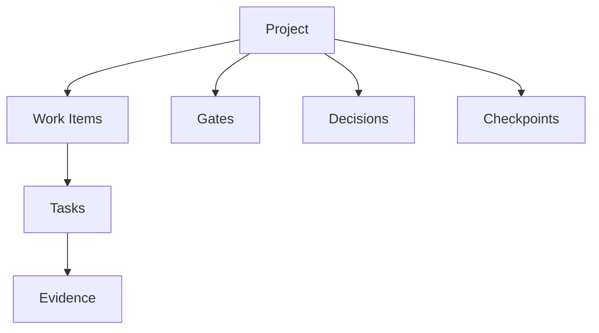
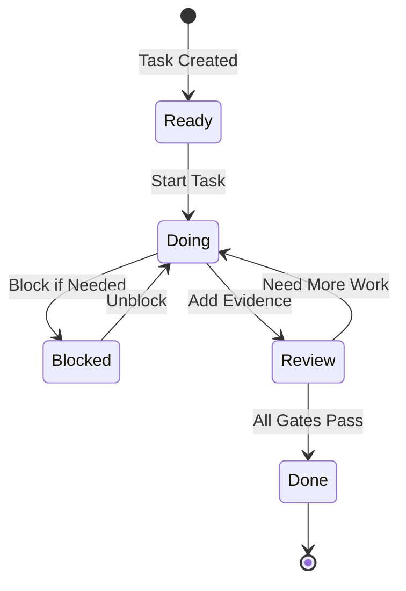

# User Guide: Getting Started with ProjectFlow via MCP

Welcome to ProjectFlow! This guide will walk you through everything you need to know to start using ProjectFlow via MCP (Model Context Protocol) integration with Cursor IDE.

## Table of Contents

1. [Introduction & Prerequisites](#introduction--prerequisites)
2. [Initial Setup](#initial-setup)
3. [Your First Project](#your-first-project)
4. [Project Management Workflow](#project-management-workflow)
5. [Task Execution Workflow](#task-execution-workflow)
6. [Advanced Features](#advanced-features)
7. [Daily Usage Patterns](#daily-usage-patterns)
8. [Troubleshooting](#troubleshooting)

## Introduction & Prerequisites

### What is ProjectFlow?

ProjectFlow is an AI-powered project and task management system designed to work seamlessly with AI coding assistants like Claude in Cursor IDE. It helps you:

- **Organize work** into projects, work items, and tasks
- **Track progress** with quality gates and evidence
- **Maintain context** with checkpoints and decision logs
- **Enforce standards** with automated gates (tests, lint, review)
- **Link repositories** to projects for seamless integration

### What You Need

Before you begin, make sure you have:

- **Cursor IDE** installed and running
- **A ProjectFlow account** (you'll create this in the setup)
- **A local code repository** (optional, but recommended)

### Overview of the Workflow

Here's the typical flow you'll follow:



## Initial Setup

### Step 1: Create a ProjectFlow Account

1. Visit your ProjectFlow web dashboard (e.g., `https://your-app.vercel.app` or `http://localhost:3000` for local development)
2. Click "Sign Up" or navigate to the login page
3. Choose your authentication method:
   - **Magic Link** (recommended): Enter your email and click "Send magic link"
   - **Email/Password**: Enter email, password, and confirm password
4. Check your email and click the authentication link (for magic link)
5. You'll be redirected to the dashboard

### Step 2: Set Up MCP Connection in Cursor

#### Option A: One-Click Connect (Recommended)

1. In the ProjectFlow dashboard, scroll to the "Set up MCP Integration" section
2. Click "Connect to Cursor"
3. Cursor will automatically open and configure the MCP server
4. You'll be prompted to authenticate via OAuth in your browser
5. After authentication, Cursor will receive OAuth tokens automatically

#### Option B: Manual Configuration

If you prefer manual setup:

1. In the ProjectFlow dashboard, expand "Set up MCP Integration"
2. Copy the configuration JSON (it will look like this):

```json
{
  "mcpServers": {
    "projectflow": {
      "url": "https://your-app.vercel.app/api/mcp"
    }
  }
}
```

3. Locate your Cursor settings file:

   - **macOS**: `~/Library/Application Support/Cursor/User/globalStorage/saoudrizwan.claude-dev/settings/cline_mcp_settings.json`
   - **Windows**: `%APPDATA%\Cursor\User\globalStorage\saoudrizwan.claude-dev\settings\cline_mcp_settings.json`
   - **Linux**: `~/.config/Cursor/User/globalStorage/saoudrizwan.claude-dev/settings/cline_mcp_settings.json`

4. Open the file and merge the `projectflow` entry into your existing `mcpServers` object
5. Save the file and restart Cursor completely

### Step 3: Verify Connection

1. In Cursor, open the chat with Claude
2. Ask Claude: "What ProjectFlow tools are available?"
3. Claude should list tools like `pm.init`, `pm.status`, `pm.work_item_create`, etc.
4. If you see an authentication error, check the troubleshooting section below

### OAuth Authentication Flow

When Cursor first connects to ProjectFlow, here's what happens:



**Note**: Tokens refresh automatically - you won't need to re-authenticate manually.

## Your First Project

### Quick Start: Simple Project Creation

The fastest way to get started is with `pm.init`:

**In Cursor, ask Claude:**

```
Initialize a new project called "My First Project"
```

Claude will call:

```json
{
  "name": "pm.init",
  "arguments": {
    "name": "My First Project",
    "description": "A new project managed by ProjectFlow"
  }
}
```

**Response:**

```json
{
  "project": {
    "id": "550e8400-e29b-41d4-a716-446655440000",
    "name": "My First Project",
    "description": "A new project managed by ProjectFlow",
    "created_at": "2025-01-15T10:30:00Z"
  },
  "gates": [
    {
      "id": "gate-1",
      "name": "tests",
      "is_required": false,
      "runner_mode": "command",
      "command": "npm test"
    },
    {
      "id": "gate-2",
      "name": "lint",
      "is_required": false,
      "runner_mode": "command",
      "command": "npm run lint"
    },
    {
      "id": "gate-3",
      "name": "review",
      "is_required": false,
      "runner_mode": "manual"
    }
  ],
  "message": "Project 'My First Project' initialized successfully. 3 gates configured."
}
```

This creates:

- A new project in ProjectFlow
- Default quality gates (tests, lint, review)
- Ready for you to start adding work items and tasks

### Full Setup: Project with Conventions

For a more complete setup that captures your project's conventions (stack, commands, environments), use `pm.init_with_interview`:

**Step 1: Get Interview Questions**

Ask Claude:

```
Get the interview questions for project initialization
```

Claude calls:

```json
{
  "name": "pm.interview_questions",
  "arguments": {}
}
```

**Step 2: Answer the Questions**

The interview asks about:

1. **Stack/Framework**: What framework are you using? (Next.js, Django, Rust, etc.)
2. **Test Command**: How do you run tests? (e.g., `npm test`, `pytest`)
3. **Lint Command**: How do you lint? (e.g., `npm run lint`, `pylint`)
4. **Type Check Command**: How do you type check? (e.g., `tsc --noEmit`, `mypy`)
5. **Dev Server Command**: How do you start dev server? (e.g., `npm run dev`)
6. **Build Command**: How do you build? (e.g., `npm run build`)
7. **Docker Enabled**: Does your project use Docker?
8. **Environments**: List your environments (e.g., `dev,staging,prod`)
9. **Recon Mode**: Automated or manual project discovery?
10. **Upload Mode**: Manual or auto result upload?

**Step 3: Initialize with Responses**

Ask Claude:

```
Initialize a project called "My Web App" with these conventions:
- Stack: Next.js
- Test: npm test
- Lint: npm run lint
- Type Check: tsc --noEmit
- Dev: npm run dev
- Build: npm run build
- Docker: Yes
- Environments: dev,staging,prod
- Recon: automated
- Upload: manual
```

Claude will call:

```json
{
  "name": "pm.init_with_interview",
  "arguments": {
    "name": "My Web App",
    "description": "A Next.js web application",
    "repoRoot": ".",
    "interviewResponses": {
      "stack": "Next.js",
      "testCommand": "npm test",
      "lintCommand": "npm run lint",
      "typeCheckCommand": "tsc --noEmit",
      "devCommand": "npm run dev",
      "buildCommand": "npm run build",
      "dockerEnabled": true,
      "environments": "dev,staging,prod",
      "reconMode": "automated",
      "uploadMode": "manual"
    }
  }
}
```

**Benefits of Full Setup:**

- Project conventions are stored for future reference
- Recon profile is generated for safe project discovery
- Primer file (`.pm/primer.md`) is created/updated with conventions
- Manifest files (`.pm/project.json`, `.pm/local.json`) are created

### Linking to Local Repository

If you provide `repoRoot` during initialization, ProjectFlow will:

1. Create `.pm/project.json` - Shared project configuration (checked into git)
2. Create `.pm/local.json` - User-specific settings (gitignored)
3. Create `.pm/.gitignore` - Protects local.json from being committed

This links your local repository to the SaaS project, enabling:

- Automatic project discovery from any subdirectory
- Team collaboration (shared project.json, personal local.json)
- Manifest validation

## Project Management Workflow

### Understanding the Hierarchy



- **Project**: Top-level container for all your work
- **Work Items**: Group related tasks (e.g., "Implement user authentication")
- **Tasks**: Individual pieces of work (e.g., "Add login form", "Write tests")
- **Evidence**: Proof of work (diffs, logs, links, notes)
- **Gates**: Quality checks (tests, lint, review)
- **Decisions**: Architectural choices recorded for context
- **Checkpoints**: Resumable project snapshots

### Checking Project Status

Use `pm.status` to get a comprehensive view of your project:

**Ask Claude:**

```
What's the status of project [project-id]?
```

**Response includes:**

- Active task (if any)
- Recent decisions
- Gate status for all gates
- Constraints and rules
- Suggested next action

### Creating Work Items

Work items group related tasks together. They're useful for:

- Tracking features or epics
- Linking to external tickets (GitHub issues, Jira tickets)
- Organizing multiple related tasks

#### Simple Work Item Creation

**Ask Claude:**

```
Create a work item for "User Authentication" in project [project-id]
```

Claude calls:

```json
{
  "name": "pm.work_item_create",
  "arguments": {
    "projectId": "550e8400-e29b-41d4-a716-446655440000",
    "title": "User Authentication",
    "description": "Implement user authentication with email/password and OAuth",
    "externalUrl": "https://github.com/user/repo/issues/123"
  }
}
```

**Response:**

```json
{
  "workItem": {
    "id": "work-item-1",
    "projectId": "550e8400-e29b-41d4-a716-446655440000",
    "title": "User Authentication",
    "status": "open",
    "created_at": "2025-01-15T11:00:00Z"
  }
}
```

#### Creating Work Items with Tasks (Interactive Prompt)

For a more structured approach, use the `pm.work_item` prompt to interactively create a work item and set up all its tasks with dependencies. This establishes a timeline where tasks are ordered by their dependencies.

**Ask Claude:**

```
Use pm.work_item to create a new work item for user authentication in project [project-id]
```

Or in Cursor, you can use the prompt directly:

```
/pm:work-item projectId=[project-id]
```

**What happens:**

The prompt guides you through an interactive process:

1. **Work Item Information**: Claude will ask for:

   - Work item title
   - Description (optional)
   - External URL (optional, e.g., GitHub issue link)

2. **Task Breakdown**: Claude will help you identify tasks:

   - Task keys (unique identifiers like "task-1", "auth-research")
   - Task types (research, implement, verify, docs, cleanup)
   - Task titles and goals
   - Dependencies between tasks

3. **Timeline Establishment**: Tasks are created with dependencies:

   - Tasks with no dependencies can start immediately
   - Tasks with dependencies must wait for their dependencies to complete
   - Multiple dependencies are supported

4. **Creation**: Once all information is gathered, Claude will:
   - Create the work item using `pm.work_item_create`
   - Create each task using `pm.task_create` in dependency order
   - Set up task dependencies using task IDs

**Example Flow:**

```
You: Use pm.work_item to create a new work item for user authentication

Claude: I'll help you create a work item for user authentication.
        What should the work item be titled?

You: User Authentication

Claude: Great! What tasks are needed for this work item?
        Let me help you break this down...

You: We need to:
        1. Research authentication libraries
        2. Implement login form (after research)
        3. Implement signup form (after research)
        4. Add OAuth integration (after login and signup)
        5. Write tests (after everything)

Claude: Perfect! I'll create the work item and tasks with the proper dependencies...
        [Creates work item and tasks]
```

**Key Benefits:**

- **Interactive Guidance**: Claude guides you through the process step-by-step
- **Timeline Establishment**: Tasks are created in dependency order, establishing a clear timeline
- **Automatic Ordering**: Tasks with no dependencies can start immediately, while dependent tasks wait
- **Validation**: The system validates that all dependencies exist and there are no circular dependencies

**How Dependencies Work:**

- Tasks with no dependencies can be started immediately
- Tasks with dependencies must wait until their dependencies are completed
- Multiple dependencies are supported (e.g., task-4 depends on both task-2 and task-3)
- Dependencies are specified using task IDs returned when creating tasks

### Creating Tasks

Tasks are the actual work units. Each task has:

- **Type**: research, implement, verify, docs, cleanup
- **Goal**: One-sentence description of what to accomplish
- **Verification**: How to verify the task is complete
- **Dependencies**: Other tasks that must complete first
- **Timebox**: Estimated time in minutes

**Ask Claude:**

```
Create a task to implement the login form for the user authentication work item
```

Claude calls:

```json
{
  "name": "pm.task_create",
  "arguments": {
    "projectId": "550e8400-e29b-41d4-a716-446655440000",
    "workItemId": "work-item-1",
    "type": "implement",
    "title": "Create login form component",
    "goal": "Build a login form with email and password fields",
    "verification": "Form renders correctly, validates input, and submits to API",
    "timeboxMinutes": 30
  }
}
```

**Response:**

```json
{
  "task": {
    "id": "task-1",
    "projectId": "550e8400-e29b-41d4-a716-446655440000",
    "workItemId": "work-item-1",
    "type": "implement",
    "title": "Create login form component",
    "goal": "Build a login form with email and password fields",
    "status": "ready",
    "timeboxMinutes": 30,
    "created_at": "2025-01-15T11:15:00Z"
  }
}
```

### Listing Work Items and Tasks

**List work items:**

```
List all work items for project [project-id]
```

**List tasks:**

```
Show me all tasks for work item [work-item-id]
```

## Task Execution Workflow

Here's the complete workflow for working on tasks:



### Step 1: Start a Task

**Ask Claude:**

```
Start working on task [task-id]
```

Claude calls:

```json
{
  "name": "pm.task_set_status",
  "arguments": {
    "taskId": "task-1",
    "status": "doing"
  }
}
```

**What happens:**

- Task status changes from `ready` to `doing`
- Task is locked to prevent conflicts
- You can now start making changes

### Step 2: Record Evidence

As you work, record evidence of your progress:

**Add a note:**

```
Record that I've created the login form component
```

Claude calls:

```json
{
  "name": "pm.evidence_add",
  "arguments": {
    "projectId": "550e8400-e29b-41d4-a716-446655440000",
    "taskId": "task-1",
    "type": "note",
    "content": "Created LoginForm component with email and password fields, validation, and error handling"
  }
}
```

**Add a link (e.g., to a PR):**

```json
{
  "name": "pm.evidence_add",
  "arguments": {
    "projectId": "550e8400-e29b-41d4-a716-446655440000",
    "taskId": "task-1",
    "type": "link",
    "content": "https://github.com/user/repo/pull/456"
  }
}
```

**Add a diff:**

```json
{
  "name": "pm.evidence_add",
  "arguments": {
    "projectId": "550e8400-e29b-41d4-a716-446655440000",
    "taskId": "task-1",
    "type": "diff",
    "content": "--- a/src/components/LoginForm.tsx\n+++ b/src/components/LoginForm.tsx\n@@ -0,0 +1,50 @@\n+export function LoginForm() { ... }"
  }
}
```

**Record touched files:**

```
Record that I modified src/components/LoginForm.tsx for task [task-id]
```

Claude calls:

```json
{
  "name": "pm.task_record_touched_files",
  "arguments": {
    "projectId": "550e8400-e29b-41d4-a716-446655440000",
    "taskId": "task-1",
    "files": ["src/components/LoginForm.tsx"],
    "autoDetect": false
  }
}
```

Or use auto-detection:

```json
{
  "name": "pm.task_record_touched_files",
  "arguments": {
    "projectId": "550e8400-e29b-41d4-a716-446655440000",
    "taskId": "task-1",
    "autoDetect": true,
    "repoPath": "."
  }
}
```

### Step 3: Run Gates

Before completing a task, run the quality gates:

**Ask Claude:**

```
Run the tests gate for project [project-id]
```

Claude calls:

```json
{
  "name": "pm.gate_run",
  "arguments": {
    "projectId": "550e8400-e29b-41d4-a716-446655440000",
    "gateName": "tests",
    "taskId": "task-1",
    "cwd": "."
  }
}
```

**Response:**

```json
{
  "run": {
    "id": "gate-run-1",
    "gateName": "tests",
    "passed": true,
    "output": "✓ 15 tests passing",
    "duration": 2.5
  }
}
```

**Check gate status:**

```
What's the gate status for project [project-id]?
```

Claude calls:

```json
{
  "name": "pm.gate_status",
  "arguments": {
    "projectId": "550e8400-e29b-41d4-a716-446655440000",
    "workItemId": "work-item-1"
  }
}
```

### Step 4: Complete the Task

Once all gates pass and you have evidence:

**Ask Claude:**

```
Mark task [task-id] as done
```

Claude calls:

```json
{
  "name": "pm.task_set_status",
  "arguments": {
    "taskId": "task-1",
    "status": "done"
  }
}
```

**Requirements:**

- Task must have evidence (enforced by system)
- If task type is "research", it must be in "review" status first
- Task cannot be blocked

### Step 5: Complete the Work Item

After all tasks in a work item are done:

**Ask Claude:**

```
Mark work item [work-item-id] as done
```

Claude calls:

```json
{
  "name": "pm.work_item_set_status",
  "arguments": {
    "workItemId": "work-item-1",
    "status": "done"
  }
}
```

**Note**: All gates must pass before a work item can be marked "done".

## Advanced Features

### Recording Decisions

Capture important architectural or design decisions:

**Ask Claude:**

```
Record a decision: We chose PostgreSQL over MongoDB because we need ACID compliance
```

Claude calls:

```json
{
  "name": "pm.record_decision",
  "arguments": {
    "projectId": "550e8400-e29b-41d4-a716-446655440000",
    "title": "Database Choice",
    "options": ["PostgreSQL", "MongoDB", "SQLite"],
    "choice": "PostgreSQL",
    "rationale": "We need ACID compliance and strong relational features for this project"
  }
}
```

### Recalling Memories

Before making decisions, recall relevant history:

**Ask Claude:**

```
What decisions have we made about database choices?
```

Claude calls:

```json
{
  "name": "pm.memory_recall",
  "arguments": {
    "projectId": "550e8400-e29b-41d4-a716-446655440000",
    "query": "database choices",
    "keywords": ["database", "storage"],
    "limit": 10
  }
}
```

**Response includes:**

- Relevant decisions
- Past outcomes
- Constraints
- Related files

### Recording Outcomes

Learn from experience by recording outcomes:

**Ask Claude:**

```
Record that the PostgreSQL decision worked well
```

Claude calls:

```json
{
  "name": "pm.record_outcome",
  "arguments": {
    "projectId": "550e8400-e29b-41d4-a716-446655440000",
    "subjectType": "decision",
    "subjectId": "decision-1",
    "result": "worked",
    "notes": "PostgreSQL has been reliable and performant",
    "createdBy": "human"
  }
}
```

### Configuring Gates

Customize gates for your project:

**Ask Claude:**

```
Configure gates: add a type-check gate that runs 'tsc --noEmit'
```

Claude calls:

```json
{
  "name": "pm.gate_configure",
  "arguments": {
    "projectId": "550e8400-e29b-41d4-a716-446655440000",
    "gates": [
      {
        "name": "type-check",
        "description": "TypeScript type checking",
        "runnerMode": "command",
        "command": "tsc --noEmit",
        "isRequired": true
      }
    ]
  }
}
```

### Plan Import/Export

Import plans from Cursor Plan Mode or export for planning:

**Import a plan:**

```
Import this plan for work item [work-item-id]: [paste markdown plan]
```

Claude calls:

```json
{
  "name": "pm.plan_import",
  "arguments": {
    "workItemId": "work-item-1",
    "planText": "# Plan\n\n## Task 1: ...\n## Task 2: ..."
  }
}
```

**Export a plan:**

```
Export the plan for work item [work-item-id]
```

Claude calls:

```json
{
  "name": "pm.plan_export",
  "arguments": {
    "workItemId": "work-item-1"
  }
}
```

## Daily Usage Patterns

### Starting a Work Session

1. **Check project status:**

   ```
   What's the status of project [project-id]?
   ```

2. **Review active tasks:**

   ```
   Show me tasks that are in progress
   ```

3. **Pick up where you left off:**
   - If there's an active task, continue working on it
   - If not, check for ready tasks or create new ones

### Resuming from Checkpoint

Checkpoints are created automatically or manually to save project state:

1. **Check for recent checkpoints:**

   ```
   Show me recent checkpoints for project [project-id]
   ```

2. **Review checkpoint summary:**

   - Checkpoints include: label, git reference, summary, resume instructions

3. **Resume work:**
   - Follow the resume instructions
   - Pick up the next task

### Checking What Needs Attention

**Ask Claude:**

```
What needs my attention in project [project-id]?
```

This will show:

- Blocked tasks (need unblocking)
- Tasks in review (need approval)
- Failed gates (need fixing)
- Work items with incomplete tasks

### Completing Work Items

When all tasks in a work item are done:

1. **Verify all gates pass:**

   ```
   Check gate status for work item [work-item-id]
   ```

2. **Mark as done:**

   ```
   Mark work item [work-item-id] as done
   ```

3. **Create a checkpoint:**
   ```
   Create a checkpoint for project [project-id] labeled "Feature X Complete"
   ```

## Troubleshooting

### Common Connection Issues

**Problem**: Cursor shows "MCP server not found" or "Connection failed"

**Solutions:**

1. Verify the MCP server URL in your Cursor settings matches your ProjectFlow deployment
2. Check that ProjectFlow is running (visit the web dashboard)
3. Restart Cursor completely (quit and reopen)
4. Check Cursor's developer console (Help > Toggle Developer Tools) for MCP errors

**Problem**: "401 Unauthorized" errors

**Solutions:**

1. OAuth tokens may have expired - Cursor should automatically refresh them
2. If refresh fails, remove the MCP configuration and reconnect
3. Verify you're logged into ProjectFlow in your browser
4. Check that popup blockers aren't preventing OAuth flow

### OAuth Authentication Problems

**Problem**: OAuth window doesn't open

**Solutions:**

1. Check browser popup blocker settings
2. Try manual configuration instead of one-click connect
3. Verify the authorization URL is correct in Cursor logs

**Problem**: "Invalid authorization code"

**Solutions:**

1. Authorization codes expire in 10 minutes - try again
2. Make sure you complete the OAuth flow in one session
3. Clear browser cookies and try again

### Tool Not Found Errors

**Problem**: Claude says "Tool pm.init not found"

**Solutions:**

1. Verify MCP connection is active (check Cursor MCP status)
2. Restart Cursor after adding MCP configuration
3. Check that ProjectFlow MCP server is running
4. Verify OAuth authentication completed successfully

### Gate Failures

**Problem**: Gate fails but command works locally

**Solutions:**

1. Check the `cwd` parameter - gates run from the project root by default
2. Verify the command matches your project's actual commands
3. Check gate output for specific error messages
4. Ensure dependencies are installed in the gate's working directory

**Problem**: "Gate not found" error

**Solutions:**

1. List gates for the project: `pm.gate_status`
2. Verify gate name matches exactly (case-sensitive)
3. Configure the gate first: `pm.gate_configure`

### Task Status Issues

**Problem**: Can't mark task as "done"

**Solutions:**

1. Ensure task has evidence (required)
2. If task type is "research", it must be in "review" status first
3. Check that task is not blocked
4. Verify all required gates pass

**Problem**: Can't start a task (status won't change to "doing")

**Solutions:**

1. Verify task status is "ready"
2. Check for dependencies - all dependent tasks must be done first
3. Ensure task is not already locked by another session

### Manifest Issues

**Problem**: "Manifest not found" when trying to discover project

**Solutions:**

1. Verify `.pm/project.json` exists in your repository
2. Run `pm.manifest_discover` from the repository root
3. If manifest doesn't exist, initialize project with `repoRoot` parameter
4. Check file permissions - ensure ProjectFlow can read the directory

## Next Steps

Now that you understand the basics:

1. **Explore the web dashboard** - View your projects, tasks, and timeline
2. **Try advanced features** - Use memories, decisions, and checkpoints
3. **Customize gates** - Set up gates that match your workflow
4. **Link more repositories** - Connect multiple projects
5. **Read technical docs** - See [docs/README.md](./README.md) for detailed guides

## Additional Resources

- **[Setup Guide](./SETUP.md)** - Complete setup instructions for developers
- **[Init Interview Guide](./INIT_INTERVIEW_GUIDE.md)** - Detailed interview documentation
- **[MCP Server README](../apps/mcp-server/README.md)** - Technical MCP server documentation
- **[Troubleshooting](../TROUBLESHOOTING.md)** - More troubleshooting solutions

---

**Happy coding with ProjectFlow!** 🚀
