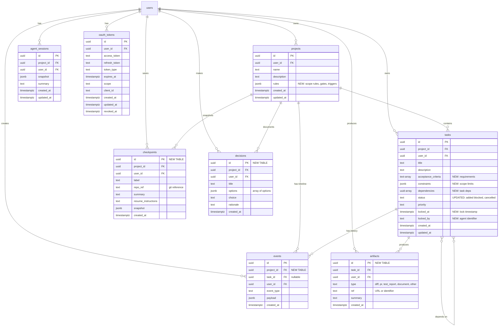
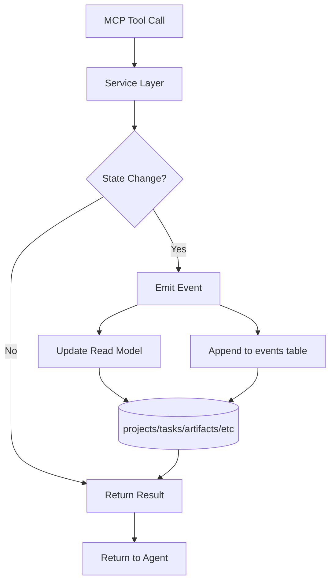

# Database Schema Overview

## Entity Relationship Diagram



## Table Summary

### Existing Tables (Enhanced)

| Table | Changes | Purpose |
|-------|---------|---------|
| **projects** | + `rules` (JSONB) | Added project-level configuration for scope rules, gates, and triggers |
| **tasks** | + `acceptance_criteria` (text[])<br>+ `constraints` (JSONB)<br>+ `dependencies` (UUID[])<br>+ `locked_at` (timestamptz)<br>+ `locked_by` (text)<br>Status enum expanded | Enhanced task model with acceptance criteria, scope constraints, task dependencies, and locking mechanism |

### New Tables

| Table | Purpose | Key Features |
|-------|---------|--------------|
| **events** | Append-only event log | Source of truth for all state changes. Indexed for efficient timeline queries. |
| **artifacts** | Task work outputs | Tracks diffs, PRs, test reports, documents. Linked to tasks. |
| **checkpoints** | Project snapshots | Resumable state with git references and instructions. |
| **decisions** | Design decisions | Documents architectural choices with rationale. |

### Unchanged Tables

| Table | Purpose |
|-------|---------|
| **agent_sessions** | Legacy session storage (may be deprecated in favor of checkpoints) |
| **oauth_tokens** | OAuth 2.1 tokens for MCP authentication |

## Indexes

### New Indexes

```sql
-- Tasks table
idx_tasks_status ON tasks(status)
idx_tasks_locked_at ON tasks(locked_at) WHERE locked_at IS NOT NULL
idx_tasks_priority ON tasks(priority)

-- Events table
idx_events_project_id ON events(project_id)
idx_events_task_id ON events(task_id) WHERE task_id IS NOT NULL
idx_events_user_id ON events(user_id)
idx_events_event_type ON events(event_type)
idx_events_created_at ON events(created_at DESC)
idx_events_project_created ON events(project_id, created_at DESC)
idx_events_task_created ON events(task_id, created_at DESC)

-- Artifacts table
idx_artifacts_task_id ON artifacts(task_id)
idx_artifacts_user_id ON artifacts(user_id)
idx_artifacts_type ON artifacts(type)
idx_artifacts_created_at ON artifacts(created_at DESC)
idx_artifacts_task_created ON artifacts(task_id, created_at DESC)

-- Checkpoints table
idx_checkpoints_project_id ON checkpoints(project_id)
idx_checkpoints_user_id ON checkpoints(user_id)
idx_checkpoints_created_at ON checkpoints(created_at DESC)
idx_checkpoints_project_created ON checkpoints(project_id, created_at DESC)

-- Decisions table
idx_decisions_project_id ON decisions(project_id)
idx_decisions_user_id ON decisions(user_id)
idx_decisions_created_at ON decisions(created_at DESC)
idx_decisions_project_created ON decisions(project_id, created_at DESC)
```

## Views

### `active_tasks`
Shows tasks currently in progress or blocked, with lock information.

```sql
SELECT 
  t.*,
  p.name as project_name,
  (t.locked_at IS NOT NULL AND t.locked_at > now() - INTERVAL '1 hour') as is_actively_locked
FROM tasks t
JOIN projects p ON t.project_id = p.id
WHERE t.status IN ('in_progress', 'blocked')
ORDER BY t.locked_at DESC NULLS LAST;
```

### `recent_events`
Recent events with project and task context.

```sql
SELECT 
  e.*,
  p.name as project_name,
  t.title as task_title
FROM events e
JOIN projects p ON e.project_id = p.id
LEFT JOIN tasks t ON e.task_id = t.id
ORDER BY e.created_at DESC;
```

### `task_progress`
Task summary with artifact counts and criteria information.

```sql
SELECT 
  t.id,
  t.project_id,
  t.title,
  t.status,
  t.priority,
  array_length(t.acceptance_criteria, 1) as total_criteria,
  COUNT(DISTINCT a.id) as artifact_count,
  t.locked_at,
  t.locked_by,
  t.created_at,
  t.updated_at
FROM tasks t
LEFT JOIN artifacts a ON t.id = a.task_id
GROUP BY t.id;
```

## Row Level Security (RLS)

All tables have RLS enabled with the following policies:

### Standard Policies (most tables)
- ✅ SELECT - Users can view their own data
- ✅ INSERT - Users can insert their own data
- ✅ UPDATE - Users can update their own data
- ✅ DELETE - Users can delete their own data

### Events Table (Append-Only)
- ✅ SELECT - Users can view their own events
- ✅ INSERT - Users can insert their own events
- ❌ UPDATE - Not allowed (events are immutable)
- ❌ DELETE - Not allowed (events are permanent)

### OAuth Tokens (Special)
- ✅ SELECT - Users can view their own tokens
- ⚠️ INSERT/UPDATE/DELETE - Via service role only (bypasses RLS)

## Data Flow



## Storage Estimates

Assuming 1000 active users with moderate usage:

| Table | Est. Rows/User | Est. Total | Storage/Row | Total Storage |
|-------|----------------|------------|-------------|---------------|
| projects | 5 | 5,000 | 1 KB | 5 MB |
| tasks | 50 | 50,000 | 2 KB | 100 MB |
| events | 500 | 500,000 | 1 KB | 500 MB |
| artifacts | 100 | 100,000 | 0.5 KB | 50 MB |
| checkpoints | 20 | 20,000 | 5 KB | 100 MB |
| decisions | 10 | 10,000 | 2 KB | 20 MB |

**Total Estimated Storage**: ~775 MB for 1000 users

### Event Log Growth

Events grow continuously (append-only):
- Average 50 events/task * 50 tasks/user = 2,500 events/user/year
- At 1 KB/event = 2.5 MB/user/year
- For 1000 users = 2.5 GB/year

**Retention Strategy**: Consider archiving events older than 1 year to cold storage.

## Performance Considerations

### Hot Paths (Optimized)
- ✅ Get project context (project + tasks + latest checkpoint)
- ✅ Get task timeline (events for a task)
- ✅ Get project timeline (events for a project)
- ✅ List active tasks (view: active_tasks)
- ✅ Get task artifacts (indexed on task_id)

### Cold Paths (Less Critical)
- Get all events for all projects (paginate)
- Full-text search across events (consider adding tsvector)
- Complex event analytics (consider materialized views)

## Backup Strategy

1. **Full backups**: Daily (Supabase handles this automatically)
2. **Point-in-time recovery**: Up to 7 days (Supabase Pro)
3. **Event log**: Consider separate archive to S3 for events > 1 year old
4. **Checkpoints**: These serve as manual restoration points

## Migration Path

1. ✅ Apply migration `20251222230000_task_focused.sql`
2. ✅ Regenerate TypeScript types
3. ⏳ Update service layer to emit events (Phase 2)
4. ⏳ Implement task lifecycle services (Phase 3)
5. ⏳ Implement MCP tools (Phase 5)
6. ⏳ Update web UI (Phase 8)

